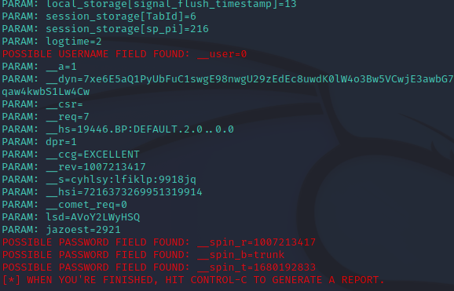

<p align="center">
  <a href="#project">Project</a>&nbsp;&nbsp;&nbsp;|&nbsp;&nbsp;&nbsp;
  <a href="#-technologies">Technologies</a>&nbsp;&nbsp;&nbsp;|&nbsp;&nbsp;&nbsp;
  <a href="#-Getting started">Getting started</a>&nbsp;&nbsp;&nbsp;|&nbsp;&nbsp;&nbsp;
  <a href="#-layout">Screenshot</a>&nbsp;&nbsp;&nbsp;|&nbsp;&nbsp;&nbsp;
</p>

<br>

---

## 💻 Projeto

Projeto pratico de Cyber Security:
Objetivo: Criar um phishing para capturar o login do Facebook do usuário

## 🧪 Technologies

This project was developed using the following technologies:
 
- [Kali Linux](https://www.kali.org/)
- [setoolkit](https://www.kali.org/tools/set/)

## 🚀 Getting started

Acessando root:
```bash
sudo su
```

Iniciando o setoolkit:
```bash
setoolkit
```

Escolhemos o tipo do ataque:
```bash
Social-Engineering Attacks
```

Vetor de ataque:
```bash
Web Site Attack Vectors
```

Método de ataque:
```bash
Credential Harvester Attack Method
```

Método de ataque:
```bash
Site Cloner
```

Digitamos o endereço IP da máquina

Por fim digitamos a URL para clone:
```bash
http://www.facebook.com
```

## Screenshot

<h1 align="center">
    
</h1>

---
<p align="center">
  Made by Maykon Raphael 👋
</p>